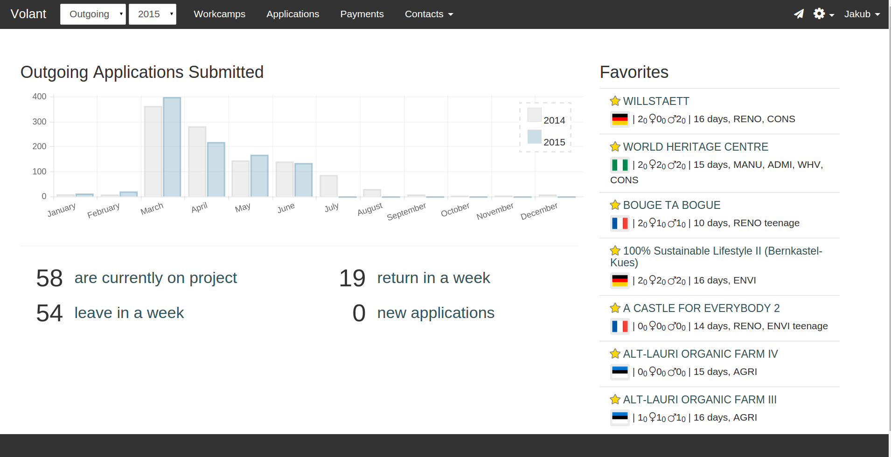

 Volant is a volunteer placement tool for NGOs in the field of
 international voluntary work. It was developed
 for [INEX-SDA](http://www.inexsda.cz/en) but
 can be used by any similar organization such as those joined in
 [Alliance Network](http://www.alliance-network.eu/) or
 [SCI](http://www.sciint.org/).

<a title='See all screenshots' class='gallery-toggle' href="#">
  See all screenshots
  </a>

## Features

### Outgoing

- advanced VEFs and workcamp searching and filtering
- VEF workflow  (pay, ask, accept/reject, infosheet, confirm)
- custom email templates
- group mailing to workcamp participants
- export into VEF.xml, PEF.xml and CSV files
- interactive PEF file export
- free places bulk editing
- alerts

### Incoming

- favorite VEFs and workcamps
- expirable bookings for workcamps
- friday list generation export
- participants export

- countries, tags and intentions (ENVI,AGRI,CULT...)
- users

## Technical

- Rails 4.2 means robust on the server side
- Ember.js spells swift on the browser
- covered by automated tests 

